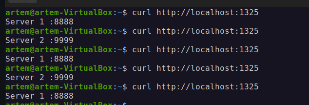
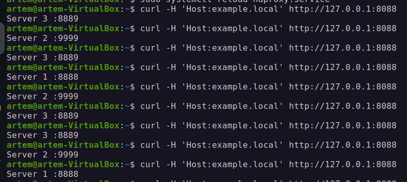

# Домашнее задание к занятию 2 «Кластеризация и балансировка нагрузки»


### Задание 1
- Запустите два simple python сервера на своей виртуальной машине на разных портах
- Установите и настройте HAProxy, воспользуйтесь материалами к лекции по [ссылке](2/)
- Настройте балансировку Round-robin на 4 уровне.
- На проверку направьте конфигурационный файл haproxy, скриншоты, где видно перенаправление запросов на разные серверы при обращении к HAProxy.

### Решение:
Настройка nginx для балансировки:
1. Создаем в домашней директории 2 папки
2. Создаем в каждой папке файл index.html с содержимым:
Для первого сервера - Server 1 :8888
Для второго сервера - Server 2 :9999
3. Запускаем из этих папкой в разных терминалах 2 сервера командами:
Для первого сервера - python3 -m http.server 8888 --bind 0.0.0.0
Для второго сервера - python3 -m http.server 9999 --bind 0.0.0.0
4. Проверяем работу серверов в отдельном терминале:
Для первого сервера - curl http://localhost:8888
Для второго сервера - curl http://localhost:9999
Получаем в ответ - Server 1 :8888 или Server 2 :9999 в зависимости от команды.
5. Создаем конфиг файл в sudo nano /etc/nginx/conf.d/example-http.conf
```conf
include /etc/nginx/include/upstream.inc;

server {
   listen	80;
   

   server_name	example-http.com;
   

   access_log	/var/log/nginx/example-http.com-acess.log;
   error_log	/var/log/nginx/example-http.com-error.log;

   location / {
		proxy_pass	http://example_app;

   }

}
```
6. Создаем директорию sudo mkdir /etc/nginx/include
7. Создаем файл в sudo nano /etc/nginx/include/upstream.inc
```conf
upstream example_app {

	server 127.0.0.1:8888 weight=3;
        server 127.0.0.1:9999;

}
```
8. Проверяем конфиг командой sudo nginx -t
9. Перезапускаем сервер systemctl reload nginx
10. Попробуем выполнить запрос для проверки балансировки curl -H 'Host: example-http.com' http://localhost
11. Настраиваем tcp балансировку, вставляем в конце файла содержимое: sudo nano /etc/nginx/nginx.conf
```conf
stream {
	include /etc/nginx/include/upstream.inc;
	server	{
		listen 8080;
		
		error_log	/var/log/nginx/example-tcp-error.log;
		proxy_pass	example_app;
	}
}
```
12. Делаем reload для применения настроек sudo systemctl reload nginx
13. Проверяем sudo curl http://localhost:8080


Настройка Haproxy:
1. Устанавливаем HAProxy: sudo apt install haproxy

2. Настраиваем конфиг файл хапрокси, дополняем файл в конце содержимым: sudo nano /etc/haproxy/haproxy.cfg
```conf
listen stats  # веб-страница со статистикой
        bind                    :888
        mode                    http
        stats                   enable
        stats uri               /stats
        stats refresh           5s
        stats realm             Haproxy\ Statistics

frontend example  # секция фронтенд
        mode http
        bind :8088
        #default_backend web_servers
	acl ACL_example.com hdr(host) -i example.com
	use_backend web_servers if ACL_example.com

backend web_servers    # секция бэкенд
        mode http
        balance roundrobin
        option httpchk
        http-check send meth GET uri /index.html
        server s1 127.0.0.1:8888 check
        server s2 127.0.0.1:9999 check


listen web_tcp

	bind :1325

	server s1 127.0.0.1:8888 check inter 3s
	server s2 127.0.0.1:9999 check inter 3s
```
3. Перезапустим сервис: sudo systemctl reload haproxy
4. Проверяем ответ: curl http://localhost:1325



### Задание 2
- Запустите три simple python сервера на своей виртуальной машине на разных портах
- Настройте балансировку Weighted Round Robin на 7 уровне, чтобы первый сервер имел вес 2, второй - 3, а третий - 4
- HAproxy должен балансировать только тот http-трафик, который адресован домену example.local
- На проверку направьте конфигурационный файл haproxy, скриншоты, где видно перенаправление запросов на разные серверы при обращении к HAProxy c использованием домена example.local и без него.

### Решение:
1. Добавляем сервер по примеру из настройки nginx и запускаем его python3 -m http.server 8889 --bind 0.0.0.0
2. Настраиваем конфиг файл хапрокси, дополняем файл в конце содержимым: sudo nano /etc/haproxy/haproxy.cfg
```conf
listen stats  # веб-страница со статистикой
        bind                    :888
        mode                    http
        stats                   enable
        stats uri               /stats
        stats refresh           5s
        stats realm             Haproxy\ Statistics

frontend example  # секция фронтенд
        mode http
        bind :8088
        #default_backend web_servers
	acl ACL_example.local hdr(host) -i example.local
	use_backend web_servers if ACL_example.local

backend web_servers    # секция бэкенд
        mode http
        balance roundrobin
        option httpchk
        http-check send meth GET uri /index.html
        server s1 127.0.0.1:8888 weight 2 check
        server s2 127.0.0.1:9999 weight 3 check
        server s3 127.0.0.1:8889 weight 4 check
```
3. Перезапустим сервис: sudo systemctl reload haproxy
4. Проверяем командой с указанием хоста: curl -H 'Host:example.local' http://127.0.0.1:8088
4. Видим, что запросы идут по указанному количеству:
